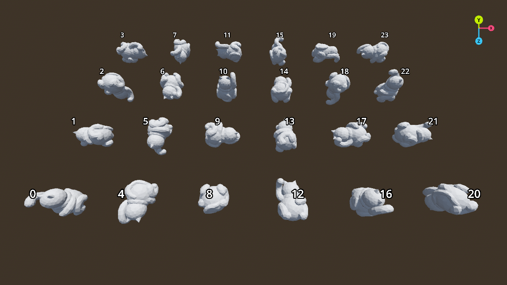

# GridMap orientations

https://uguu-org.itch.io/gridmap-orientation

This project shows the 24 orientations for use with [set_cell_item](https://docs.godotengine.org/en/stable/classes/class_gridmap.html#class-gridmap-method-set-cell-item).

Current documentation says use `get_orthogonal_index_from_basis` for this, and read the [source](https://github.com/godotengine/godot/blob/a83eb16fba5bb3da086b41cbd79e6f95b09eb8ee/modules/gridmap/grid_map.cpp#L435) for additional details.  Interpreting the basis vectors wasn't very intuitive for me, hence this project.

## Usage

Honestly the screenshot above is all I needed, but I made it interactive just for fun.

| Key        | Mouse button | Action                             |
|------------|--------------|------------------------------------|
| Arrow keys | Left         | Adjust camera position and target. |
| WASD       | Right        | Adjust camera target.              |
|            | Middle       | Adjust camera position.            |
| Plus/Minus | Wheel        | Zoom in / zoom out.                |
| R          |              | Reset camera.                      |
| Space      |              | Toggle display mode.               |

## License

This project runs on Godot 4, which is released under [MIT license](https://godotengine.org/license)

This project is also released under MIT license.
